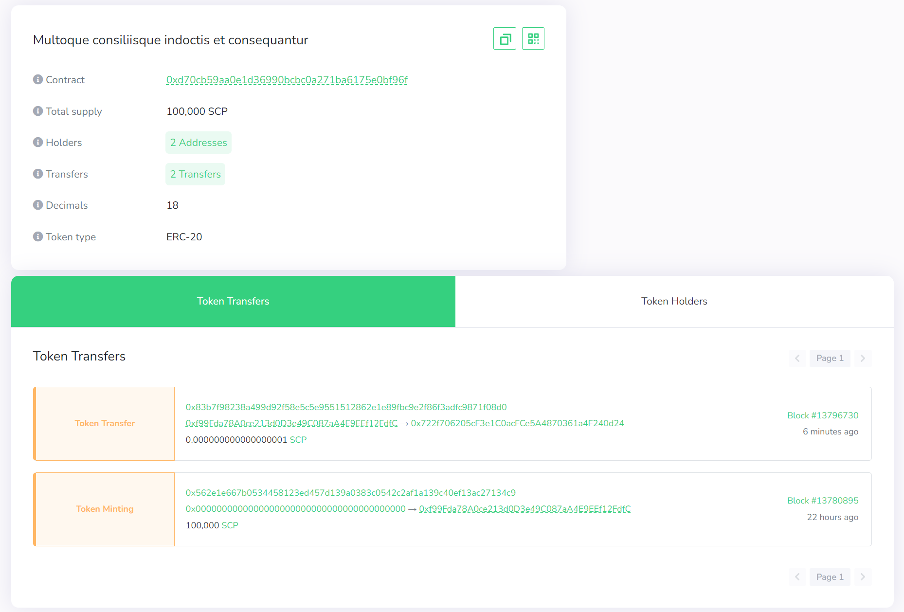

# Smart Copyright Licensing DApp


## Description

This is a copyright licensing marketplace DApp for digital works, where users can:

- Protect their works by signing it with our Smart~Copy token
- Distribute copyright licenses to other users for reuse
- Work owners can update their work information or delete their work if no license has been issued
- Owners can choose not to sell licenses for their works
- Only owners can see the update/delete buttons and aren't allowed to buy copyright licenses for their works.

The novelty here is the ability to sign your work by creating ERC20 tokens that represent it and transfer it to users who purchase a license to use it.

## Smart Contract Functionality Added

- Create an ERC20 token for each work created
- Transfer the token to the buyer
- Update license selling status only by owners
- Update work details
- Delete work only if licenses have not been issued

## Front End Functionality Added

- Edit work button, that opens a modal with preloaded work titles of the current user in a select box.
- Once any title is selected it unveils a form within the same modal, prefilled with the work details.
- Conditional display of the Buy/Delete buttons –– only owners can delete and only non-owners can buy
- View Details button, that opens a modal for displaying details of each work including terms of use set by owners
- There are links to ERC20 tokens for each work
- Utility to hide the Buy button for 1 minute when a license has been purchased –– to simulate a license expiry date

## TODO

- Fix timestamp incompatibility issue between smart contract and the frontend
- Allow owners to set a license expiry date for their works
- Use NFTs to represent works instead of ERC20 tokens

## Live Demo

[Smart Copyright Licensing DApp](https://danielgraham123.github.io/smartcopy/)

## Usage

### Requirements

1. Install the [CeloExtensionWallet](https://chrome.google.com/webstore/detail/celoextensionwallet/kkilomkmpmkbdnfelcpgckmpcaemjcdh?hl=en) from the google chrome store.
2. Create a wallet.
3. Go to [https://celo.org/developers/faucet](https://celo.org/developers/faucet) and get tokens for the Alfajores testnet.
4. Switch to the alfajores testnet in the CeloExtensionWallet.

### Test

1. Register a work.
2. Create a second account in your extension wallet and send them cUSD tokens.
3. Buy a work license with the second account.
4. Check if the balance of the first account increased.
5. Check your wallet to see if you have the Work License Token
6. Create another work.
7. Click the View info button to view work details
8. Click the edit button and select any work to update.
9. Update the details including switching from selling to not selling.
10. Delete a work whose license hasn't been issued.

### A Sample Work License Token and its transfer after a purchase



## Project Installation

```
npm install
```

or

```
yarn install
```

## Start

```
npm run dev
```

## Build

```
npm run build
```
